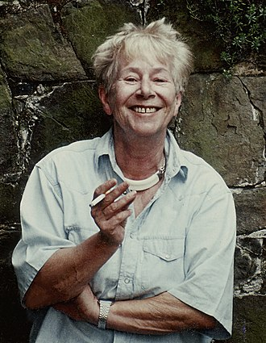

<!--

author: Moritz Riemann
email:  riemann@philsem.uni-kiel.de
version: 0.1
language: en
narrator: UK English Female

\-->

# Heimat (050285)

* Moritz Riemann (<riemann@philsem.uni-kiel.de>)

* Sprechstunde:  ----Boschstraße 1, R. 01.001

**Inhalt**

Heimat ist ein viel bemühter und aufgeladener Begriff, den nur das Deutsche in dieser Bedeutung kennt.
Doch was heißt Heimat? Lässt sie sich verorten, oder ist sie doch nur, wie Ernst Bloch am Ende von Das Prinzip Hoffnung schreibt „etwas, das allen in der Kindheit scheint, und worin noch niemand war"?
Wir wollen in diesem Seminar dem Heimatbegriff von kultureller, politischer und umweltphilosophischer Seite nähern, ihn kritisieren und ergründen, warum er so oft als konservativer Kampfbegriff bemüht wird.

## "Regierungserklärung"

1. Die Teilnahme am Seminar erfordert die vorbereitende, gründliche Lektüre der Texte.

2. Eine regelmäßige und aktive Teilnahme aller Seminarteilnehmenden ist Voraussetzung für ein gelingendes Seminar.
3. Philosophische Seminare leben vom diskursiven Austausch. Nehmt in Euren Diskussionsbeiträgen auf den Text und aufeinander Bezug, lasst einander ausreden und vermeidet lange, abschweifende Exkurse.
4. Meine Sprechsstunde (----) ist offen für alle Anliegen, es ist keine Anmeldung erforderlich.
5. Bevor Ihr eine Email schreibt: Seht im Seminarplan nach, ob die gesuchte Information dort zu finden ist.

## Zuordnung und Prüfungsleistungen

* BA 6 (Praktische Philosophie II - Vertiefung): Hausarbeit im Umfang von 10 Seiten
* BA7/BA8 (Kulturphilosophie, Naturphilosophie): Referat, Essay, Hausarbeit, Mündliche Prüfung
* BA9 (Problemstellungen und Theorien der Gegenwartsphilosophie): Hausarbeit oder Essay
* BA10 (Forschungsorientiertes Abschlussmodul): Referat
* PHF-phil-WP (Philosophische Reflexion und ethische Urteilskraft): Essay (5-7 Seiten)

**Allgemeine Hinweise**  

* Grundlage für ein erfolgreiches Seminar ist das intensive Lesen der bereitgestellten Texte und die Bereitschaft zur Diskussion der jeweiligen Positionen. Versuchen Sie, die Texte einzuordnen und in einen Kontext von für Sie relevanten Fragestellungen zu setzen. Fertigen Sie hierzu eigene Mitschriften an und überlegen Sie sich vor jeder Sitzung einige Fragen, die sich beim Lesen der Texte ergeben. Recherchieren Sie im Vorfeld Begriffe, die Ihnen womöglich unklar oder ungenau erscheinen und bringen sie etwaige Unklarheiten in die Diskussion ein.

**Hinweise zu den Modulen und den Prüfungsleistungen**

* In den beiden Wahlpflichtmodulen BA7 und BA8 sind aus den drei Gegenstandsbereichen Naturphilosophie, Kulturphilosophie und Wissenschaftsphilosophie zwei verschiedene Gegenstandsbereiche zu wählen. Bitte beachten Sie also: Der im Modul BA7 gewählte Gegenstandsbereich muss ein anderer sein als der im Modul BA8 gewählte Gegenstandsbereich!
* Beachten Sie die Handreichung zum wissenschaftlichen Arbeiten im Fach Philosophie. 
* Jedes Referat, jede Hausarbeit und jeder Essay sind im Vorfeld in der Sprechstunde abzustimmen. Ein persönliches Gespräch mit dem Dozenten (Sprechstunde) zur Vorbereitung ist Voraussetzung für die Annahme der Arbeit. 
* Die Abgabe erfolgt als Ausdruck, mit Deckblatt und unterschriebener Eigenständigkeitserklärung an der Hauptpforte oder im Briefkasten für Prüfungsleistungen in der LS4. **Eine Abgabe per Email ist nicht ausreichend!**
* Referate: Gehen Sie davon aus, dass alle Teilnehmenden die Texte gelesen haben. Vermeiden Sie also eine bloße Inhaltsangabe. Versuchen Sie, den Argumentationszusammenhang herauszustellen und in den Kontext des Seminars einzubetten. Klären Sie Begriffe und stellen Sie gern auch einzelne Textpassagen ausführlicher dar, die Sie für besonders bezeichnend erachten. Im Umfang sollten 30 Minuten nicht überschritten werden. Die Erstellung eines Handouts und/oder einer Präsentation ist obligatorisch.
 
## Essay als Prüfungsart

### 1. Der philosophische Essay

Mit dem Essay als Prüfungsform stellt sich das Philosophische Seminar der Kieler Universität in eine philosophische Tradition, die in dieser literarischen Form die eigenständige Auseinandersetzung mit
einer Frage und These wagt und einen eigenen Gedanken entfaltet. Der Essay (von frz. *essai*: „Versuch“ >
lat. *exagium*, dt. „wägen“, „Gewicht“) ist ein prägnanter Aufsatz über ein philosophisches Problem, eine
kontrovers diskutierte Fragestellung oder These. Im Unterschied zu einer Hausarbeit, in der eine
sachorientierte und systematische Behandlung eines Themas erwartet wird, kommt es beim Essayschreiben
darauf an, das jeweilige Thema in einem größeren Zusammenhang zu ‚erwägen‘, d.h. zu erörtern, um zu einer eigenen Position zu finden und deutlich Stellung zu beziehen. Der Essay erlaubt stilistisch eine größere Freiheit als die wissenschaftliche Hausarbeit, jedoch handelt es sich nicht um eine persönliche Meinungsäußerung, sondern um eine argumentativ begründete Auseinandersetzung.

Die Tradition des philosophischen Essays geht auf die *Essais* von Michel de Montaigne (1533-1592) zurück und betont die eigene Denkbewegung und das erforschende Suchen eines Standpunktes. Mit der essayistischen Form ist eine besondere Form des Philosophierens verbunden, deren Fokus weniger auf der systematischen Auseinandersetzung liegt, sondern vielmehr in der Darstellung der Denkbewegung und Entfaltung eines Gedankens selbst. Mit Francis Bacon (1561-1626), der das Wort von Montaigne übernommen und ins Englische übertragen hat, wird *Essay* zur Gattungsbezeichnung nicht nur philosophischer, sondern auch literarischer Schriften. Beide Autoren gelten als ´Ahnväter´ der philosophischen Essayistik.

Die semantische Erkundung von *essai/essaier* gibt erste Hinweise auf die Unmittelbarkeit und Erfahrungsorientiertheit der essayistischen Denk- und Schreibweise: Wer essayistisch denkt und schreibt, fängt bei sich, d.h. den eigenen Erfahrungen mit der Welt und mit sich selbst an; sie/er unterzieht dabei die eigenen Sichtweisen, Erfahrungen, Urteile, aber auch das, was an Sichtweisen, Erfahrungen, Urteilen anderer jeweils begegnet, einer denkenden Prüfung oder Erwägung. Wenn es sich bei dem Geschriebenen noch dazu um Versuche handelt, so sind die damit verbundenen Wissens-, Erkenntnis- oder Wahrheitsansprüche anscheinend deutlich herabgestimmt. Zugleich bedeutet die essayistische Denkweise aber auch die Erprobung einer Perspektive auf eine bestimmte Sache (seien es Dinge, Sachverhalte/Phänomene, Situationen, Ereignisse), um sie zu erschließen und zu beurteilen.

Eine Hochzeit der philosophischen Essayistik lag in der europäischen Aufklärung des 18. Jahrhunderts. Die Zeit der kritischen Emanzipation von tradierten Herrschaftsverhältnissen hat namhaften Essayisten wie Voltaire in Frankreich, David Hume in England und Gotthold Ephraim Lessing in Deutschland hervorgebracht.

 
Das Essayschreiben erfordert in besonderer Weise kritisches Selbstdenken und die Entwicklung einer eigenständigen Argumentation. Auch wenn die Rückbeziehung auf persönliche bzw. alltägliche Erfahrungen dabei ein wesentlicher Bestandteil der Essayistik ist, **so liegt im Philosophiestudium der Akzent beim Essayschreiben doch deutlich auf der gedanklichen Auseinandersetzung mit einer philosophischen Problemstellung/Kontroverse oder einer philosophischen Position oder einem philosophischen Begriff.** In diesem Kontext kommt es darauf an, sich philosophische Texte methodisch erschließen zu können, um sie angemessen zu verstehen und auszulegen. Mit Hans Georg Gadamer lässt sich der Vorgang des Verstehens als ein Bemühen beschreiben, mit dem Text ´ins Gespräch zu kommen´, d.h. den historischen Horizont des Textes mit dem eigenen „Verstehenshorizont der Gegenwart“, seinen impliziten Maßstäben und legitimen Vorurteilen zu „verschmelzen“.[^1] Eine gute Vorbereitung für diese **hermeneutische Herangehensweise beim Essayschreiben** ist es, sich vor der Lektüre die eigenen Erwartungen an den Text bzw. an das Thema und das eigene Vorverständnis zu vergegenwärtigen.[^2] Wie bei einem Gespräch mit einem unbekannten Menschen, kann dies dazu beitragen, das Gefühl der Fremdheit zu überwinden und dem Gelesenen gegenüber aufgeschlossen zu bleiben – also: aufmerksam ´zuzuhören´. 

[^1]: H.-G. Gadamer: *Wahrheit und Methode. Grundzüge einer philosophischen Hermeneutik.* Tübingen 1960. 6. Aufl. 1990. S.289f. 

[^2]: Vgl. Thomas Rentsch/Johannes Rohbeck: *Essays schreiben – aber mit Methode.* In: Jahrbuch für Didaktik der Philosophie und Ethik 8 (2007). S. 75-81. hier S.78f.

**Literaturhinweise**

Montaigne, Michel de: *Essais*. Übers. v. Hans Stilett. Frankfurt a.M. 2001.

Bacon, Francis: *Essays oder praktische und moralische Ratschläge*. Übers. v.  Elisabeth Schücking. Hrsg. v. Levin Schücking. Stuttgart 2011.

Konersmann, Ralf: *Essay*. in: Ders.: Wörterbuch der Unruhe. Frankfurt a. M. 2017. S.49-55.

Černy, Lothar: *Essay*, in: Historisches Wörterbuch der Philosophie. Hrsg. v. Joachim Ritter, Karlfried Gründer und Gottfried Gabriel. Basel 1971-2007. Bd. 2, Sp.746-749.

Schärf, Christian: *Geschichte des Essays. Von Montaigne bis Adorno.* Göttingen 1999.

### 2. Der Essay als Prüfungsart in den Bachelor- und Masterstudiengängen Philosophie

Der Essay kann in den BA-Wahlpflichtmodulen BA7 und BA8 als eine unter vier Prüfungsarten gewählt werden (Umfang: ca. 10 Seiten); im Modul BA9 ist er neben einer Hausarbeit als weitere Prüfungsart vorgeschrieben. – In den Masterstudiengängen Philosophie ist der Essay verpflichtende Prüfungsart in den Modulen MAA1 bzw. MAE2. 
Die Form des Essays als Prüfungsleistung ist offener als bei einer Hausarbeit. Zur Form gehören die Zitation und eine Bibliographie, wie es auch die wissenschaftliche Hausarbeit fordert. Jedoch sind strenge Strukturierungen mit einem Inhaltsverzeichnis und einer Kapitelstruktur nicht erforderlich. Selbstverständlich gehört zur Prüfungsleistung des Essays ebenso ein Titelblatt wie die aktuelle Eigenständigkeitserklärung. Die offenere Form liegt in größerer sprachlicher und stilistischer Freiheit. Die eigene Perspektive auf eine philosophische Frage oder einen philosophischen Gedanken darf ausgeführt werden, ohne dabei reine Meinungsäußerung zu sein. Es darf mit Beispielen zur Veranschaulichung und Sprachbildern, Metaphern, Fragen gearbeitet werden. Dabei sollte jedoch eine erkennbare Ordnung der Gedanken, d.h. nachvollziehbare Gedankengänge und die erforderliche logische Konsistenz nicht vernachlässigt werden. Ziel ist es einen Standpunkt zu er- und begründen und eine kritische Reflexion eines philosophischen Gegenstandes vorzunehmen.
Es bestehen verschiedene Möglichkeiten, einen Essay zu verfassen. Jonas Pfister[^3] unterscheidet drei Formen des studentischen Essays: 1) den *kritischen* Essay, der eine kritische Prüfung einer philosophischen These vornimmt; 2) den *problemlösenden* Essay, der die Lösung eines philosophischen Problems versucht, und 3) den *urteilenden* Essay, der die Entscheidung eines philosophischen Streits versucht. Jay F. Rosenberg[^4] erläutert wie in einem Essay eine *begründete Verteidigung einer These* erfolgt.

**Achtung:** Das Thema des Essays ist in der Regel im Rahmen des Seminarhorizonts frei gewählt, aber stets mit den Dozent*innen abzustimmen! Das gleiche gilt für etwaige spezifischen Anforderungen des Essays als Prüfungsleistung, die von der jeweiligen Lehrperson festgelegt werden. Diese können von den hier formulierten Anforderungen abweichen.

**Hinweise zum Essayschreiben** s. Lektion zum Essay im **E-Learning Kurs** *Wissenschaftliches Arbeiten im Fach Philosophie*, 3.6/Lektion 13:

[^3]: Vgl. Pfister, Jonas: *Werkzeuge des Philosophierens*. S.246-250.

[^4]: Vgl. Rosenberg, Jay F.: *Philosophieren. Ein Handbuch für Anfänger*. Frankfurt a. M. 2009. S.81.

  
## Semesterplan

| **23.10.2024** | **Eröffnung, Organisatorisches** | **Referat** |
|------------|------------------------------|---------|
| 30.10.2024 | Ina-Maria Greverus: Auf der Suche nach Heimat. München: Beck 1979. S. 7-34. | kein Referat |
| 6.11.2024 | **Provinz als Heimat:** Martin Heidegger: Schöpferische Landschaft. Warum bleiben wir in der Provinz. GA 13. S. 9-13. // Ders.: Bauen. Wohnen. Denken. GA 7. 145-164 // Dazu: Paul Parin: Heimat, eine Plombe. In: Die Zeit 23.12.1994.| Referat: |
| 13.11.2024 | **Heimat als Geborgenheit:** Otto Friedrich Bollnow: Die neue Geborgenheit. Stuttgart 1955. S. 168-202. | Referat: |
| 20.11.2024 | **Heimat als Utopie:** Ernst Bloch: Das Prinzip Hoffnung. Frankfurt/Main: Suhrkamp. S. 1622-1628. // Bernhard Schlink: Heimat als Utopie. Frankfurt/Main 2000| Referat: |
| 27.11.2024 | **Heimatlosigkeit:** Vilem Flusser: Bodenlos. Eine philosophische Autobiographie. Düsseldorf: Bollmann. S. 9-30.| Referat: |
| 4.12.2024 | **Heimatlosigkeit:** Vilém Flusser: Wohnung beziehen in der Heimatlosigkeit. In: ders.: Von der Freiheit des Migranten. Hamburg:eva 2013. S. 15-30.| Referat: |
| 11.12.2024 |**Heimkehr:** Adorno/Horkheimer: Dialektik der Aufklärung. Exkurs 1 (Odysseus oder der Mythos der Aufklärung) | Referat: |
| 18.12.2024| Barbara Cassin: Nostalgie | Referat: |
| 8.01.2025 | Barbara Cassin: Nostalgie | Referat: |
| 15.01.2025| Homi K. Bhabha: Über kulturelle Hybridität. Wien 2012. (Auszug) | Referat: |
| 22.01.2025 |Naika Foroutan: Heimat. Erde. Migration. Kursbuch 198: Heimatt. Hamburg 2019. // Navid Kermani: Es kann noch schrecklich viel passieren. Rede zur Verleihung des Thomas Mann Preises 2024.| Referat: |
| 29.01.2025| Sasha Marianna Salzmann: Sichtbar. In: Aydemir/Yaghoobifarah (Hg. 2019): Eure Heimat ist unser Albtraum. Berlin. S. 13-26. // Fatma Aydemir: Arbeit. In: Aydemir/Yaghoobifarah (Hg. 2019): Eure Heimat ist unser Albtraum. Berlin. S. 27-37.| Referat: |
| 5.2.2025 | **Abschlussdiskussion** |  |

**unterrichtsfrei: 23.12.2024-04.01.2025**

## 1. Sitzung am 23. Oktober 2024

**Literaturzum Thema (Auswahl)**

* Hannah Arendt, Wir Flüchtlinge, In: Ders.: Zur Zeit. Politische Essays, hrsg. v. Marie Luise Knott, aus dem Amerikanischen v. Eike Geisel, Berlin 1986
* Bernhard Schlink, Heimat als Utopie, Frankfurt a.M. 1999.
* Beate Beckmann-Zöller und René Kaufmann, Heimat und Fremde. Präsenz im Entzug, Dresden 2015.
* Fatma Aydemir, Hengameh Yaghoobifarah, Eure Heimat ist unser Albtraum, Ulstein 2024.
* Vilém Flusser, Wohnung beziehen in der Heimatlosigkeit, In: Ders.: Bodenlos. Eine philosophische Autobiographie, Bensheim/Düsseldorf 1992, S. 247-264 Karen Joisten, Heimisch in der Fremde – Fremdsein im Heimischen? Anmerkungen zur Lebensaufgabe, der zu werden, der man sein könnte. In: Hasse, Jürgen (Hrsg.): Das Eigene und das Fremde. Heimat in Zeiten der Mobilität. Freiburg/München 2018, S. 85-106.
* Karen Joisten, Heimat und Heimatlosigkeit. Philosophische Perspektiven, in: Religion und Migration heute. Perspektiven - Positionen - Projekte. Hg. v. Jürgen Manemann und Werner Schreer. Regensburg 2012, S. 215-226.
* Karen Joisten, Der Mensch als Heim-weg, in: Die politische Meinung, 57. Jg., Juli/Aug. 2012, S. 39-46. 
* Jean Améry, Wieviel Heimat braucht der Mensch?, in: ders. Schuld und Sühne, 13. Aufl., Stuttgart 2023.
* Ernst Bloch, Das Prinzip Hoffnung. In 5 Teilen. Frankfurt am Main 1985.
* Otto Friedrich Bollnow, Mensch und Raum, 7. Aufl. Stuttgart/Berlin/Köln 1977.
* Wilfried von Bredow/Hans-Friedrich: FoltinZwiespältige Zufluchten. Zur Renaissance des Heimatgefühls. Berlin/Bonn 1981.
* Martin Buber, Ich und Du. 13. Aufl. Gerlingen 1997.
* Bundeszentrale für politische Bildung (Hrsg.): Heimat. Analysen, Themen, Perspektiven. Schriftenreihe Bd. 294/1. Gesamtkonzeption Cremer, Willi und Klein, Ansgar. Bonn 1990.
* Karlfried von Dürckheim, Untersuchungen zum gelebten Raum, in: Neue Psych. Studien Bd. 6,H. 4, München 1932, 381 t80.
* Werner Gent, Die Philosophie des Raumes und der Zeit. Historische, kritische und analytische Untersuchungen. 2 Bde. Hildesheim 1962.
* Alexander Gosztonyi, Der Raum. Geschichte seiner Probleme in Philosophie und Wissenschaf- ten. 2 Bde. Freiburg/München 1976.
* Ina-Maria Greverus, Der territoriale Mensch. Ein literaturanthropologischer Versuch zum Hei- matphänomen. Frankfurt am Main 1972.
* Ina-Maria Greverus, Auf der Suche nach Heimat. München: Beck 1979.
* Ute Guzzoni, Wohnen und Wandern. Düsseldorf 1999.
* Karen Joisten, Vom Subjekt zum Projekt". Verluste des Mensch-Seins in der „Post-Anthropologie" Vilem Flussers. In: Anthropologie der Medien - Mensch und Kommunikationstechnologien. Hrsg. v. Jörg Albertz. Berlin 2002, 51-64.
* Michael Neumeyer, Heimat. Zu Geschichte und Begriff eines Phänomens. Kiel 1992.
* Rainer Piepmeier, Philosophische Aspekte des Heimatbegriffs. In: Heimat. Analysen, Themen, Perspektiven. Bundeszentrale für politische Bildung (Hrsg.). Schriftenreihe Bd.294/1. Gesamtkonzeption Willi Cremer, Ansgar Klein. Bonn 1990, 91-108.
* Elisabeth Ströker, Philosophische Untersuchungen zum Raum. Frankfurt am Main 1965.
* Heinz Treziak, Heimat der Philosophie. Zur Rückbindung des Denkens an den Ort seines Ent- stehens. In: Heimat der Philosophie. Symposion 1985 in Meßkirch. Hrsg. v. der Stadt Meß- kirch. O.J., 112-130.
* Martin Walser, Heimatkunde. Aufsätze und Reden. Frankfurt am Main 1968.
* Harry Pross, Heimat und Heimatlosigkeit, hrsg. von Christina Dericum/Philipp Wambolt, Berlin: 1987.
* Edoardo Costadura/Klaus Ries, Heimat gestern und heute Interdisziplinäre Perspektiven, Bielefeld 2016.
* Karl Wolfskehl, Absage an die Heimat, in: Winkler, Michael (Hrsg.): Deutsche Literatur im Exil 1933 bis 1945. Texte und Dokumente, Stuttgart 1977, S. 424- 427
* Anne Kuhlmann, Das Exil als Heimat. Über jüdische Schreibweisen und Metaphern, In: Krohn, Claus-Dieter, u.a. (Hrsg.): Sprache – Identität – Kul- tur. Frauen im Exil (= Exilforschung. Ein internationales Jahrbuch, Bd. 17), München 1999, S. 198-213.
* Ulrich Hemel/Jürgen Manemann, Heimat finden – Heimat erfinden: politisch-philosophische Perspektiven, Paderborn 2017.
* Armin Nassehi, Die empirische Heimatlosigkeit der Moderne. Skizze einer Leerstelle, in: Ulrich Hemel/Jürgen Manemann, Heimat finden – Heimat erfinden: politisch-philosophische Perspektiven, Paderborn 2017.
* Sönke Friedreich, Die Entstehung des Heimatgedankens aus der Mobilität. In: Manfred Seifert (Hg.): Zwischen Emotion und Kalkül. ‚Heimat‘ als Argument im Prozess der Moderne, Leipzig: 2010, S. 87-101.
* Joachim Klose, Heimatschichten. In: Ders. (Hg.): Heimatschichten. Anthropologische Grundlegung eines Weltverhältnisses, Wiesbaden 2013, S. 19-44.
*	Judith N. Shklar, Verpflichtung, Loyalität, Exil, hrsg. v. Hannes Bajohr, Berlin: 2019. 
*	 Christian Schüle, Heimat. Ein Phantomschmerz, München 2017.
*	Francesca Vidal, „Heimat – Worin noch niemand war?“, in: Bloch-Jahrbuch 2005, Mössingen-Talheim 2005, 122-128.
*	Georg Lukács: Theorie des Romans: ein geschichtsphilosophischer Versuch über die Formen der großen Epik, Hamburg 1963.
*	Stefan Hormuth, Ortswechsel als Gelegenheit zur Änderung des Selbst. Diss. Heidelberg 1989.
*	Marc Auge, Orte und Nicht-Orte. Vorüberlegungen zu einer Ethnologie der Einsamkeit. Frankfurt 1994.
*	Beate Mitzscherlich, Heimat ist etwas, was ich mache. Herbolzheim 2000.
*	Brigitte Rauschenbach, „Nun ade, du mein lieb Heimatland. Überlegungen zur Heimat als Grenzbegriff“, in: Wilfried Belschner u. a. (Hrsg.): Wem gehört die Heimat?, Leverkusen 1995 und B. Rauschenbach: Deutsche Zusammenhänge. Zeitdiagnose als politische Psychologie, Zürich/Osnabrück 1995.
*	Maja Soboleva, Ist ,Heimat‘ ein Mythos? Der Heimatbegriff zwischen Bezeichnung und Bedeutung, Zeitschrift für Philosophie (2020/4), https://doi.org/10.1515/dzph-2020-0035. 
*	Costadura, E., Ries, K., u. Wiesenfeld, C. Heimat global. Modelle, Praxen und Medien der Heimatkonstruktion, Bielefeld 2019.
*	Hüls, M., u. Sondermann, M. (2019), Heimat als Kosmos – Über Heimatplaneten, gesellschaftliche und individuelle Heimaten, in: Hüls et al. (2019), 67–86.
*	Hüls, M., Kühne, O., u. Weber, F. (Hg.) (2019), Heimat – ein vielfältiges Konstrukt, Wiesbaden. 
*	Hüppauf, B. (2007), Heimat – Die Wiederkehr eines verpönten Wortes. Ein Populärmythos im Zeitalter der Globalisierung, in: Gebhard, G., Geisler, O., u. Schröter, S. (Hg.), Heimat. Kontouren und Konjunkturen eines umstrittenen Konzepts, Bielefeld, 109–140.
*	Mitzscherlich, B. (2019), Heimat als subjektive Konstruktion. Beheimatung als aktiver Prozess, in: Costadura et al. (2019b), 183–196.
*	Weichhart, P. (2019), Heimat, raumbezogene Identität und Descartes’ Irrtum, in: Hüls et al. (2019), 53–66.

**Sonstiges**

* Lindemann, Klaus (Hg.), „Heimat". Gedichte und Prosa. Stuttgart 1992.
*	DLF: „Heimat – der offene Begriff ([hier] https://www.deutschlandfunk.de/heimat-als-utopie-heimat-der-offene-begriff-100.html) 
*	[DFL: „Heimat gibt Kraft"](https://www.deutschlandfunknova.de/beitrag/philosophie-heimat-gibt-kraft)) 
*	Philosophie.ch: „Nachdenken über Heimat“](https://www.philosophie.ch/heimat) 
*	[Youtube: Auf ein Wort...Heimat | Michel Friedman im Gespräch mit Karen Joisten](https://www.youtube.com/watch?v=-Mj3-WkcVhQ)
*[	Sternstunde Philosophie: „Was passiert, wenn der Klimawandel die Heimat zerstört?“](https://www.youtube.com/watch?v=7KUJwM2vbns&pp=ygUVcGhpbG9zb3BoeSBkZXIgaGVpbWF0)
*	[Sternstunde Philosophie: „Ijoma Mangold: Was bedeutet die eigene Herkunft fürs Leben?“ ](https://www.youtube.com/watch?v=MQUwm84GHxI)
*	[Philosophie.ch: „Nachdenken über Heimat – philosophische Lebenskunst“](https://www.philosophie.ch/2017-03-01-rose)
*	[Bundeszentrale für politische Bildung: „Was ist Heimat? – Definitionen](https://https://www.bpb.de/lernen/angebote/grafstat/projekt-integration/134586/info-03-05-was-ist-heimat-definitionen/)
*	Ute Vorkoeper: Heimat. Eine Einführung, in: Zeit-online vom 01. 12. 2005 online. 

## 2. Sitzung am 30.10.2024

**Ina-Maria Greverus** (1929-2017)

* Studium der Germanistik, Skandinavistik, Kunstgeschichte in Marburg und Uppsala
* Promotion in Marburg 1956
* Habilitation 1970 in Gießen: *Der territoriale Mensch. Ein literaturanthropologischer Versuch zum Heimatphänomen.* Frankfurt am Main 1972.
* 1974 Gründung des Instituts für Kulturanthropologie und Europäische Ethnologie an der Universität Frankfurt am Main.
* 1979 Aufsatzsammlung *Auf der Suche nach Heimat*

